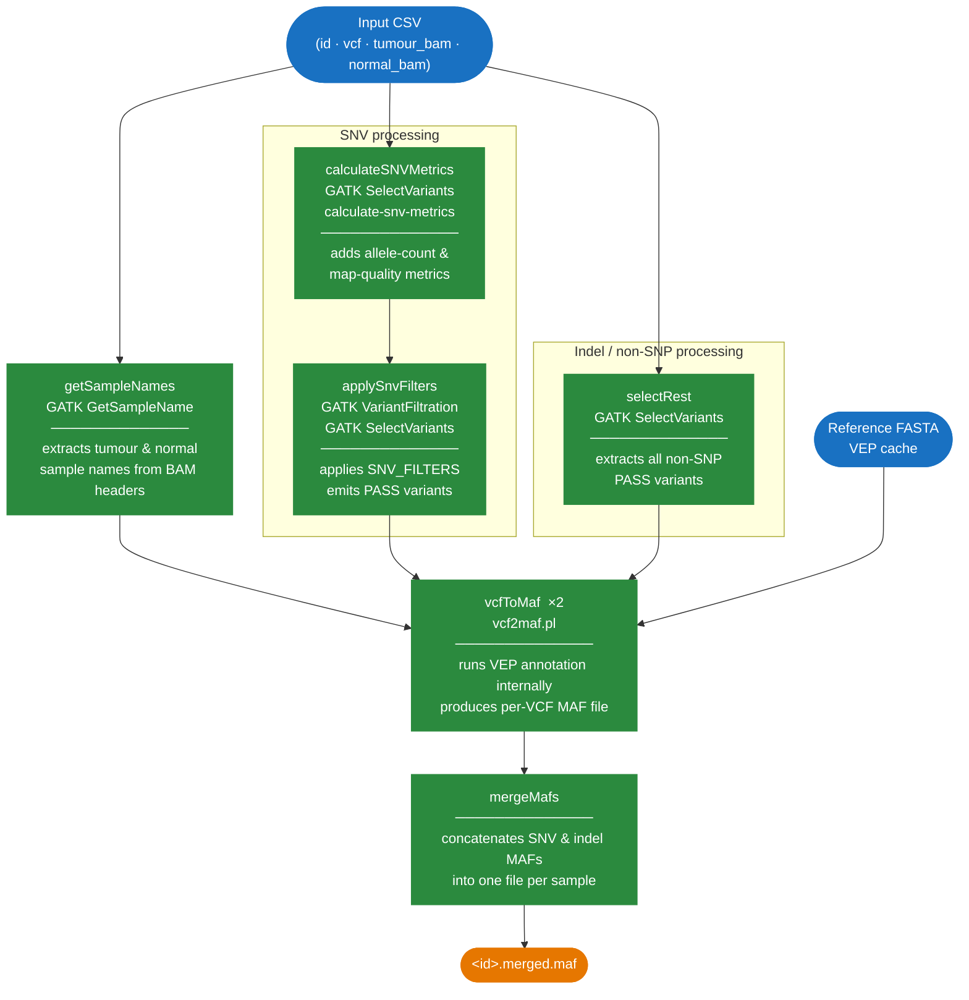

# nf-filter-snvs

A [Nextflow](https://www.nextflow.io/) DSL2 pipeline that filters somatic
SNVs from tumour (with optional matched normal) VCF files using custom
allele-count and mapping-quality metrics, then converts all passing
variants — both SNVs and indels — to
[MAF](https://docs.gdc.cancer.gov/Data/File_Formats/MAF_Format/) format
using [vcf2maf](https://github.com/mskcc/vcf2maf).

---

## Workflow



---

## Requirements

| Requirement | Version |
|---|---|
| [Nextflow](https://www.nextflow.io/docs/latest/install.html) | ≥ 20.0.0 |
| [Singularity](https://docs.sylabs.io/guides/latest/user-guide/) | any recent version |
| Container image | `crukcibioinformatics/filter-snvs:latest` |

The pipeline is designed to run with Singularity (pulled automatically
from Docker Hub). The container bundles GATK, VEP, vcf2maf, htsjdk-tools,
and R/tidyverse.

---

## Quick Start

```bash
nextflow run crukci-bioinformatics/nf_filter_snvs \
    -profile cluster \
    -params-file params.yml
```

---

## Running the Pipeline

### Basic command

```bash
nextflow run crukci-bioinformatics/nf_filter_snvs -params-file params.yml
```

### Selecting a profile

```bash
# Run on a SLURM cluster (Singularity enabled)
nextflow run crukci-bioinformatics/nf_filter_snvs \
    -params-file params.yml -profile cluster

# Run on the epyc SLURM queue
nextflow run crukci-bioinformatics/nf_filter_snvs \
    -params-file params.yml -profile epyc

# Run locally on a large server
nextflow run crukci-bioinformatics/nf_filter_snvs \
    -params-file params.yml -profile bigserver
```

| Profile | Executor | Notes |
|---|---|---|
| `standard` | local | 4 CPUs / 8 GB RAM |
| `bigserver` | local | 50 CPUs / 128 GB RAM |
| `cluster` | SLURM | Singularity enabled |
| `epyc` | SLURM (`epyc` queue) | Singularity enabled, conda disabled |

### Resuming a previous run

Nextflow caches every completed task. If a run is interrupted, resume it
without re-running completed steps:

```bash
nextflow run crukci-bioinformatics/nf_filter_snvs \
    -params-file params.yml -resume
```

### Singularity image cache

Avoid re-downloading the container on every run by setting a persistent
cache directory:

```bash
export NXF_SINGULARITY_CACHEDIR=/path/to/singularity_cache
```

### Using a local Singularity image

If you have already built or downloaded a Singularity image (`.sif` file),
you can point Nextflow directly at it instead of pulling from Docker Hub.
Add the following to your `nextflow.config` or a `-c` override file:

```groovy
process.container = '/path/to/filter-snvs.sif'

singularity {
    enabled    = true
    autoMounts = true
}
```

Or pass it on the command line:

```bash
nextflow run crukci-bioinformatics/nf_filter_snvs \
    -params-file params.yml \
    -with-singularity /path/to/filter-snvs.sif
```

The `.sif` can be built from the Docker image using the container Makefile
(see [Building the Container](#building-the-container)).

---

## Inputs

### Input CSV file

The pipeline is driven by a CSV file (default name: `inputs.csv`,
configurable with `INPUTS_CSV`). It must contain the following columns:

| Column | Required | Description |
|---|---|---|
| `id` | Yes | Sample identifier. Must be unique. Non-alphanumeric characters (except `.`, `_`, `-`) are replaced with `_`. |
| `vcf` | Yes | VCF filename or path. Must be bgzip-compressed (`.vcf.gz`) with a co-located `.tbi` index. |
| `tumour_bam` | Yes | Tumour BAM filename or path. Must have a co-located `.bai` index (`file.bai` or `file.bam.bai`). |
| `normal_bam` | No | Matched-normal BAM filename or path. Leave blank for tumour-only samples. Column must still be present. |

**Example:**

```csv
id,vcf,tumour_bam,normal_bam
sample_A,sample_A.vcf.gz,sample_A.tumour.bam,sample_A.normal.bam
sample_B,sample_B.vcf.gz,sample_B.tumour.bam,
```

> **Note:** Column names must be lowercase with underscores exactly as
> shown above (`tumour_bam`, not `tumourBam`).

### Index file requirements

The pipeline checks for associated index files at start-up and will exit
immediately if any are missing.

| File type | Required index |
|---|---|
| VCF (`.vcf.gz`) | `.vcf.gz.tbi` (tabix index) |
| BAM (`.bam`) | `.bam.bai` or `.bai` |
| Reference FASTA | `.fai` (samtools faidx) and `.dict` (Picard) |

### Sarek VCF directory structure

If VCF files were produced by the [nf-core/sarek](https://nf-co.re/sarek)
pipeline, pass `--sarek_output true`. When `VCF_DIR` is also set, the
pipeline will look for each VCF under a subdirectory named after its
sample ID:

```
<VCF_DIR>/<id>/<vcf>
```

For example, with `VCF_DIR: /data/sarek_results` and `id: sample_A`, the
VCF is resolved as `/data/sarek_results/sample_A/sample_A.vcf.gz`.

---

## Parameters

### Parameters file

All parameters can be placed in a YAML file and passed with `-params-file`:

```yaml
# required
REFERENCE_FASTA: "/path/to/genome.fa"
INPUTS_CSV:      "inputs.csv"
vepCache:        "/path/to/vep_cache"
vepFasta:        "/path/to/vep.fa"
species:         "homo_sapiens"
assembly:        "GRCh38"

# optional
BAM_DIR:    "/path/to/bams"
VCF_DIR:    "/path/to/vcfs"
OUTPUT_DIR: "filtered_vcfs"
INTERVALS:  "/path/to/targets.bed"
```

### Required parameters

| Parameter | Description |
|---|---|
| `REFERENCE_FASTA` | Path to the reference genome FASTA (must have co-located `.fai` and `.dict` files). |
| `vepCache` | Path to the VEP cache directory. |
| `vepFasta` | Path to the VEP FASTA file (used by vcf2maf). |
| `species` | Species name in VEP format, e.g. `homo_sapiens`, `mus_musculus`. |
| `assembly` | Genome assembly name, e.g. `GRCh38`, `GRCm38`. |

### Optional parameters

| Parameter | Default | Description |
|---|---|---|
| `INPUTS_CSV` | `inputs.csv` | Path to the input CSV file. |
| `OUTPUT_DIR` | `<launchDir>/filtered_vcfs` | Directory for output files. |
| `BAM_DIR` | `null` | Directory containing BAM files. If set, the `tumour_bam` and `normal_bam` values in the CSV are resolved relative to this directory. |
| `VCF_DIR` | `null` | Directory containing VCF files. If set, `vcf` values in the CSV are resolved relative to this directory. |
| `INTERVALS` | `null` | BED or Picard interval list file. If set, GATK processes are restricted to these regions. |
| `sarek_output` | `false` | Set to `true` if VCF files follow the nf-core/sarek subdirectory structure (see above). |
| `SNV_FILTERS` | see below | GATK VariantFiltration filter expressions applied to SNVs. |

### Default SNV filters

The following filters are applied by `gatk VariantFiltration`. Variants
failing any filter are excluded from the final MAF. All thresholds can be
overridden by setting `SNV_FILTERS` in your params file.

| Filter name | Expression | Description |
|---|---|---|
| `VariantAlleleCount` | `< 3` | Fewer than 3 reads support the variant allele |
| `VariantAlleleCountControl` | `> 1` | More than 1 read supports the variant allele in the normal |
| `VariantMapQualMedian` | `< 40.0` | Median mapping quality of variant-supporting reads is low |
| `MapQualDiffMedian` | `< -5.0 \|\| > 5.0` | Large difference in mapping quality between variant and reference reads |
| `LowMapQual` | `> 0.05` | More than 5% of variant-supporting reads have mapping quality 0 |
| `VariantBaseQualMedian` | `< 25.0` | Median base quality at the variant position is low |

**Override example** (in `params.yml`):

```yaml
SNV_FILTERS: >
  --filter-name VariantAlleleCount
  --filter-expression 'VariantAlleleCount < 5'
  --filter-name LowMapQual
  --filter-expression 'LowMapQual > 0.1'
```

---

## Outputs

All outputs are written to `OUTPUT_DIR` (default: `filtered_vcfs/`).

| File | Description |
|---|---|
| `<id>.rest.vcf` | PASS non-SNP variants (indels, MNPs, etc.) extracted from the input VCF. |
| `<id>.snv.metrics.filtered.vcf` | SNVs with filter annotations applied (PASS and FAIL variants retained). |
| `<id>.snv.metrics.pass.vcf` | PASS SNVs only, after all metric-based filters have been applied. |
| `<id>.merged.maf` | Final output: MAF file containing all PASS SNVs and indels, annotated by VEP via vcf2maf. |

---

## VEP Cache

vcf2maf runs VEP internally. You must supply a pre-built VEP cache
matching your species and assembly. Caches can be downloaded from the
[Ensembl FTP site](https://ftp.ensembl.org/pub/):

```bash
# Example: mouse GRCm39, VEP release 115
wget https://ftp.ensembl.org/pub/current/variation/indexed_vep_cache/mus_musculus_vep_115_GRCm39.tar.gz
tar zxf mus_musculus_vep_115_GRCm39.tar.gz -C /path/to/vep_cache
```

The cache directory (containing the species subdirectory) is passed via
`vepCache`.

### VEP version compatibility

The container ships **VEP 115.2**. The VEP cache version must match the
VEP version installed in the container — a mismatch will cause vcf2maf
to fail.

If you are working with an older assembly whose latest supported cache
predates release 115 (for example, mouse GRCm38 is supported up to
release 102), you will need a container built with the corresponding VEP
version. In that case, pin the VEP version in `container/conda.yml`
(e.g. `bioconda::ensembl-vep=102`) and rebuild:

```bash
cd container
make build version=0.2-GRCm38
```

Then point your run at the new image (see
[Using a local Singularity image](#using-a-local-singularity-image)).

---

## Building the Container

The Docker image is published as `crukcibioinformatics/filter-snvs`. To
rebuild locally:

```bash
cd container

# Build with the default 'latest' tag
make build

# Build and push a versioned release to Docker Hub
make release version=0.2

# Convert to a local Singularity image
make singularity version=0.2
```
